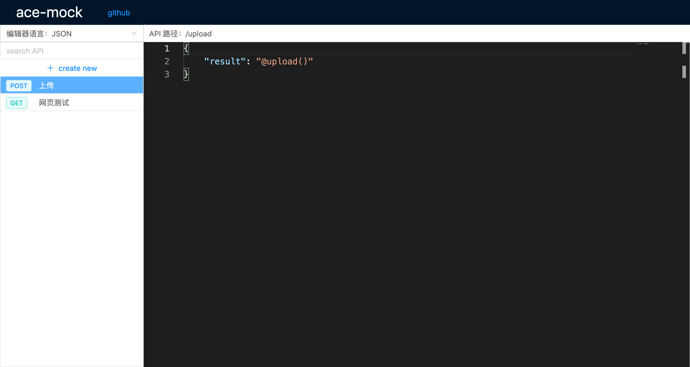
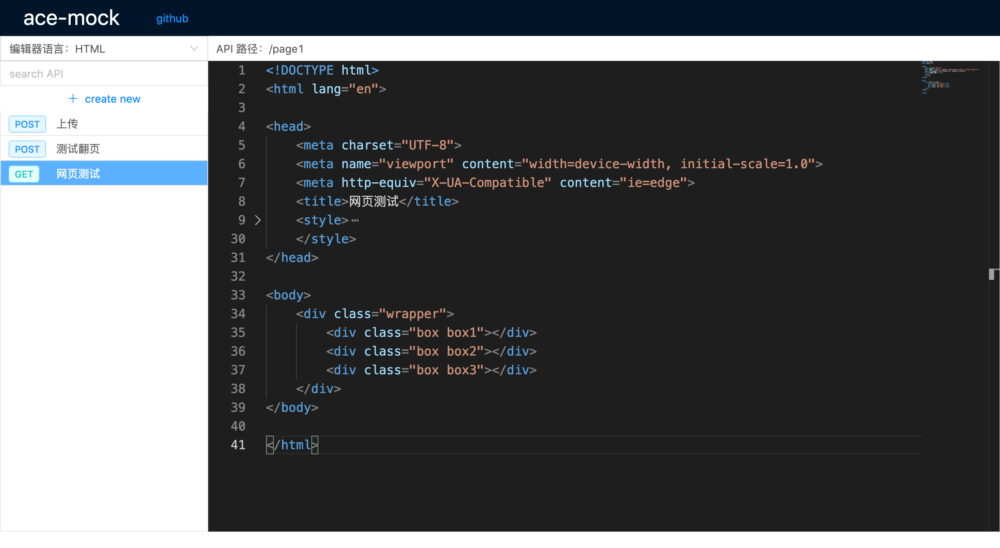

# 一款前端 api mock 工具

#### 界面预览



#### 安装
```sh
$ yarn global add ace-mock
# 或
$ npm i -g ace-mock
```

#### 使用

```
$ ace-mock [options]
```

#### 示例

```sh
$ ace-mock
# 或
$ ace-mock --port=12345
```

执行上述命令后，就会开启 mock 服务，地址为：`http://localhost:12345`

## 更多功能（持续奇思妙想中，欢迎贡献）

1、ace-mock 支持 Mock.js 语法，如有需要，可以参考：http://mockjs.com/examples.html

**示例：**

```json
{
  "list|30": [
    {
      "id": "@guid",
      "title": "@ctitle(10, 20)",
      "date": "@date('yyyy-MM-dd')"
    }
  ]
}
```

2、支持字段回显，语法：`@request(field)`

**示例：**

请求列表接口的时候，需要用到翻页，因为当前页数是由前端控制的，所以可以使用`@request`语法来回显前端发送过来的页数：

```json
{
  "code": 200,
  "message": "ok",
  "currentPage": "@request(page)",
  "total": 50,
  "resultList|10": [
    {
      "id": "@guid",
      "title": "@ctitle(10, 20)",
      "date": "@date('yyyy-MM-dd')"
    }
  ]
}
```

假设接口为：POST /test

这时前端请求：`curl -X POST -d page=2 http://localhost:12345/test`

返回：

```json
{
  "code": 200,
  "message": "ok",
  "currentPage": 2, <--这里被替换为请求的字段了
  "total": 50,
  "resultList": [
    //...
  ]
}
```

3、支持文件上传，语法：`@upload()`

示例，上传照片：

```json
{
  "status": 200,
  "message": "ok",
  "result": "@upload()"
}
```

前端使用表单上传单张照片后会返回如下结果：

```json
{
  "status": 200,
  "message": "ok",
  "result": "http://localhost:12345/files/file-1579452917264.jpg"
}
```

批量上传多张照片后会返回如下结果：

```json
{
  "status": 200,
  "message": "ok",
  "result": [
    "http://localhost:12345/files/file-1579452927117.jpg",
    "http://localhost:12345/files/file-1579452927118.jpg",
    "http://localhost:12345/files/file-1579452927125.jpg"
  ],
}
```

4、模拟网络延迟，语法：`"@delay": 1000`，单位：ms

示例：

```json
{
  "@delay": 1000, 
  "status": 200,
  "message": "ok",
  "result": "@upload()"
}
```

这样在请求该接口后，服务端将会延迟 1000 毫秒才会向前端响应结果，这样在测试慢速网络下的交互或逻辑异常是非常有帮助的。

5、GET 方法的接口可以使用 HTML

示例：



这时，访问：`http://localhost:12345/page1` 就可以看到所编辑的页面了

你可以使用它来做一些测试，样式调整等，很方便。

甚至，你还可以在服务器上启动 ace-mock，就可以在线编辑网页，做一些简单的页面展示。
