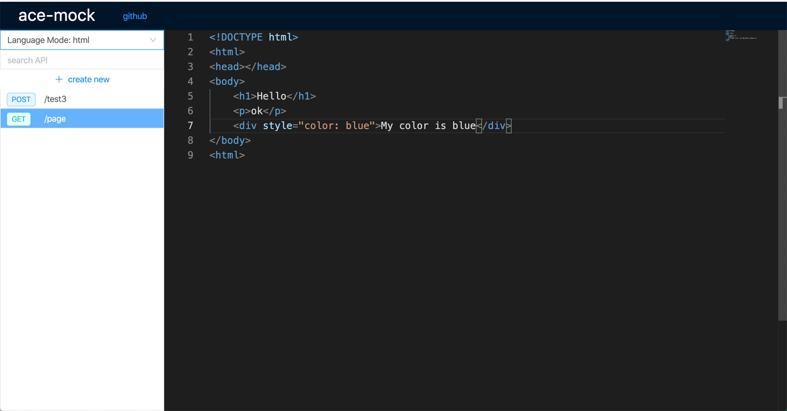

## A fast api-mock service

POST method API：


GET method HTML page：



ace-mock support Mock.js grammar，you can browse this page to learn more: http://mockjs.com/examples.html

#### install
```sh
$ yarn global add ace-mock
# or
$ npm i -g ace-mock
```

#### usage

```
$ ace-mock [options]
```

#### example

```sh
$ ace-mock
# or
$ ace-mock --port=your port
```

Then it will start a service to serve at:`http://localhost:12345`address in default.

Now, you can browse this page and set your api.
